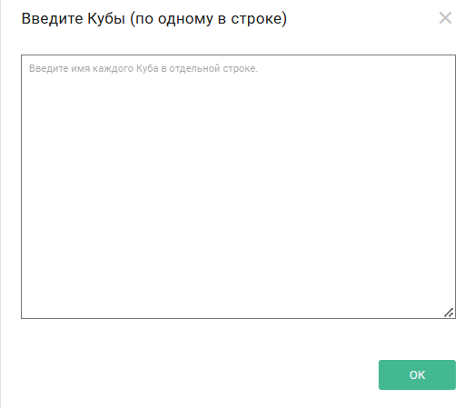
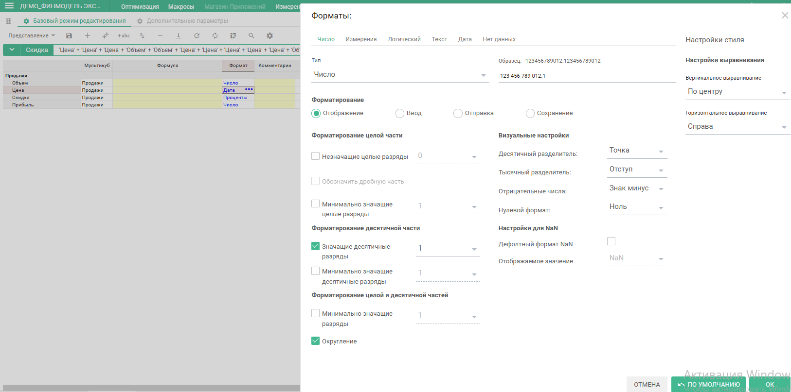
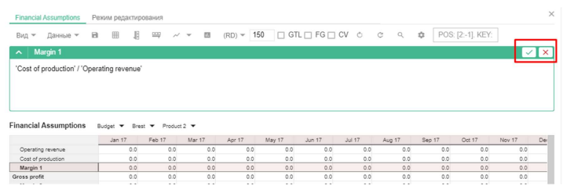

# Руководство по Моделированию Optimacros

## Базовая концепция построения мультикубов

### Создание мультикубов

**Мультикуб** представляет собой аналог сводной таблицы Microsoft Excel, в которой строками и столбцами, фильтрами могут выступать справочники из разделов. Мультикубы состоят из набора кубов.

**Куб** (мера понятия OLAP-кубов, значение в понятиях сводных таблиц) - это многомерная конструкция, особенностью которой является единый формат данных.

Для создания мультикуба перейдите к пункту главного меню **Данные > Мультикубы > Добавить Мультикуб**.

![multicube][1]

[1]: index.assets/Multicube1.png

В открывшемся диалоговом окне **Новый Мультикуб**, на вкладке **Основные**, в графе **Измерения и выборки** отображены будут все существующие в модели измерения это-
(время, версии, справочники) и их выборки. Переместите нужные измерения в графу **Новый Мультикуб**.

![multicube2][2]

[2]: index.assets/Multicube2.png

В поле кубы введите наименования кубов с имеющимися данными для дальнейшего расчета.

Каждое наименование вводится с новой строки.

Ввод большого количества кубов удобен через диалоговое окно **Введите кубы**, для вызова которого щелкните по значку ![pen][3]{: style="height:20px;width:20px"} в поле Кубы.

[3]: index.assets/pencil.png

Потянув за правый нижний угол, можно изменить размер поля ввода.

Кнопка **Разместить** укажет местоположение измерений (в строках, колонках или фильтрах), которые указываются по усмотрению.

Перейдите во вкладку **Расширенные**, чтобы определить дополнительные настройки: имя мультикуба, папку, в которой мультикуб будет содержаться на панели Содержимое и позицию вставки относительно других мультикубов.

Давайте назовем нашу мультикуб "Продажи", и добавим кубы, такие как:

- объем
- цена
- скидка
- прибыль

![multicube4][4]

[4]: index.assets/Multicube4.png

Нажимаем создать и наш мультикуб создается.

### Режим редактирования

Далее перейдем в режим редактирования, где мы можем просмотреть и изменить детали и настройки кубов в рамках данного мультикуба.

Нам сейчас необходимо изменить формат кубов.

Настроим формат для куба "Цена". Для этого необходимо щелкнуть правой кнопкой мыши по нужному кубу и выбрать пункт контекстного меню **Форматирование > Изменить настройки > Изменить формат данных**.

Куб может иметь в разные форматы. Во вкладке "Число" мы можем поменять отображение либо число, либо процент, а также отображать значащие цифры в десятичные знаки какой
выбрать разделитель, отображение отрицательных чисел и нулевой формат.

Также куб может быть форматом какого-либо справочника либо иметь логический формат, текстовый формат, даты или вообще не иметь данных, может иметь формат файла, объекта.

Нам понадобится для куба "Цена" указать 1 десятичный знак, нажимаем **OK**, для куба "Скидка" сделаем формат "Проценты".

Также настроим стили отображения кубов.

Куб "Скидка" выберем стиль и могут быть разные выберем "heading 3", а "Прибыль" будет у нас "Summary 1".

Теперь выйдем из режима редактирования и внесем данные в кубы "Объемы", "Цена".

Данные можно вносить только в ячейки, подсвеченные синим цветом.

### Внесение даннных, логика формул

Введем объем для трех месяцев, например 5 000, 7500, 6000, также введем цену.

Скидка у нас будет определяться в зависимости от объема. Для этого мы воспользуемся формулой

    IF THEN ELSE

Для ввода формул выберите нужный куб, нажмите на редакторе формул откроется окно редактора, также можем перейти в "редактирование формул" и став формулу строку и нажать пробел.

- Если формуле нужно использовать данные определенного куба, находясь в редакторе формул, нужно щелкнуть по заголовку нужного куба.

- Если нужно использовать будет данные из другого мультикуба, находясь в редакторе формул, через панель "содержимое" или "главное меню", можно перейти к нужному мультикубу, и выбрать куб.

- Если нужно будет использовать элемент справочника, версии временного измерения, находясь в редакторе формул через "главное меню" необходимо перейти к нужному измерению и выбрать нужный элемент.

Имя функции необходимо вводить заглавными буквами.

Пример:

Напишем условие, в котором сначала мы проверим заполненность объема по месяцам. Для этого мы пишем IF, ссылаемся куб "Объем" и здесь мы пишем, что он не равен нулю.

    IF "Объем"<>0 THEN ELSE

Тогда нужно выполнять условия если объем больше 5000, тогда размер скидки будет 15%, иначе будет 10%. Теперь нам нужно закрыть первое условие, и если оно не выполняется, будет стоять 0. Мы видим что скидка рассчиталась.

    IF "Объем">5 000 THEN "Скидка" = 15% ELSE "Скидка"=10%

Стоит заметить, что формула работает на весь период времени, при наличии других измерений для них работала бы точно так же.

Теперь рассчитаем прибыль.

Переходим в режим редактирования формулы и вводим ссылки на другие кубы.

Для начала откроем скобки, прибыль мы посчитаем как объем, из него мы вычтем объем, умноженные на скидку и все это мы будем умножать на цену.

    "Прибыль" = ("Объем"-"Объем"*"Скидка")*"Цена"
