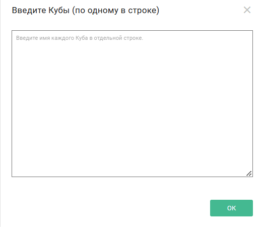
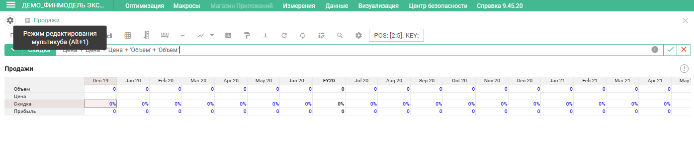
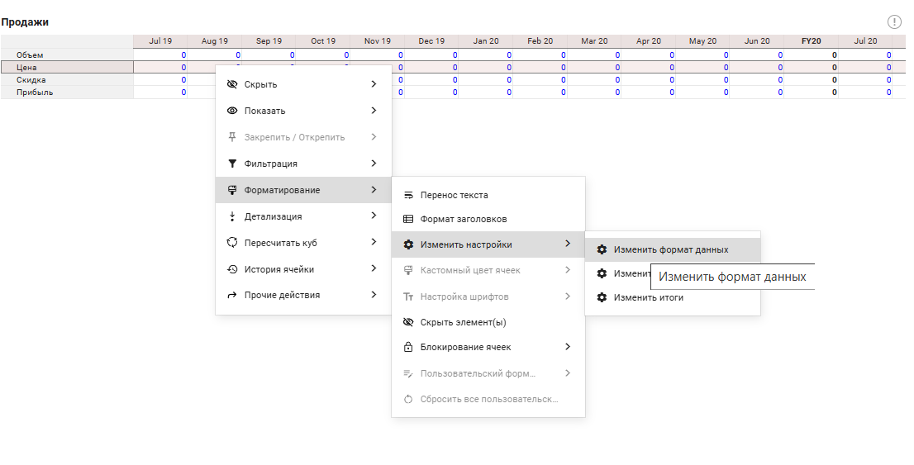
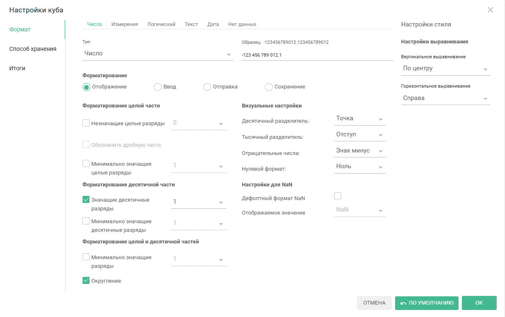
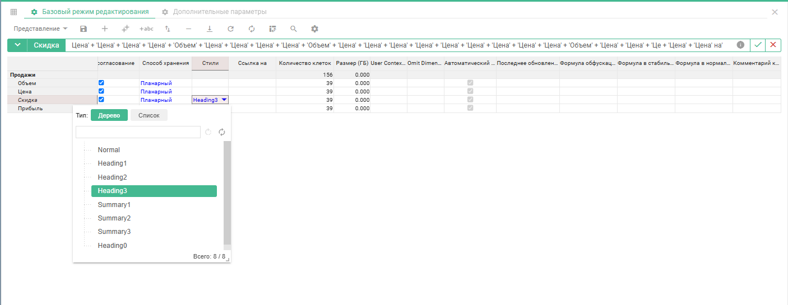
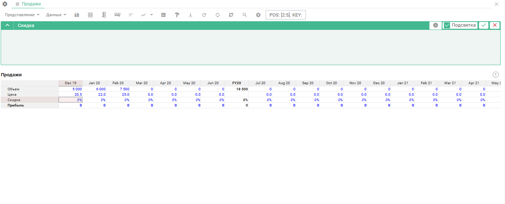
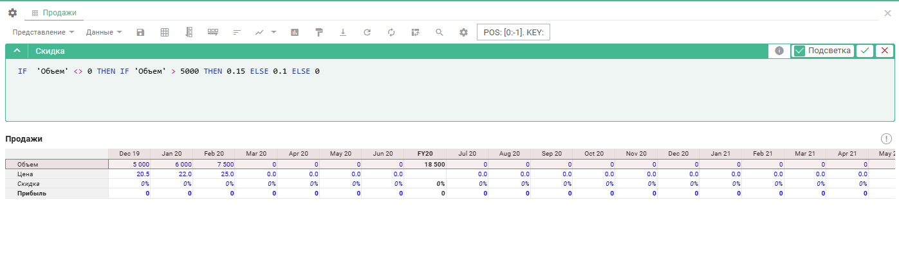
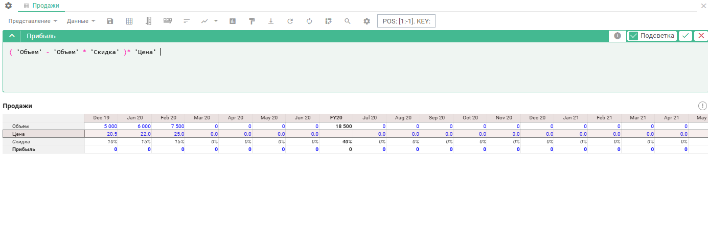

# Руководство по Моделированию Optimacros

## Базовая концепция построения мультикубов

### Создание мультикубов

**Мультикуб** представляет собой аналог сводной таблицы Microsoft Excel, в которой строками и столбцами, фильтрами могут выступать справочники из разделов. Мультикубы состоят из набора кубов.

**Куб** (мера понятия OLAP-кубов, значение в понятиях сводных таблиц) - это многомерная конструкция, особенностью которой является единый формат данных.

Для создания мультикуба перейдите к пункту главного меню **Данные > Мультикубы > Добавить Мультикуб**.

![multicube][1]

[1]: index.assets/Multicube1.png

В открывшемся диалоговом окне **Новый Мультикуб**, на вкладке **Основные**, в графе **Измерения и выборки** отображены будут все существующие в модели измерения:

- время,
- версии,
- справочники

и их выборки. Переместите нужные измерения в графу **Новый Мультикуб**.

![multicube2][2]

[2]: index.assets/Multicube2.png

В поле **Кубы** введите наименования кубов с имеющимися данными для дальнейшего расчета.

Каждое наименование необходимо вводить с новой строки.

Ввод большого количества кубов удобен через диалоговое окно **Введите кубы**, для вызова которого необходимо нажать по значку ![pen][3]{: style="height:20px;width:20px"} в поле **Кубы**.

[3]: index.assets/pencil.png

Для изменения размера диалогового окна, необходимо потянуть за правый нижний угол.

Кнопка **Разместить** укажет местоположение измерений (в строках, колонках или фильтрах).

Перейдите во вкладку **Расширенные**, чтобы определить дополнительные настройки: имя мультикуба, папку, в которой мультикуб будет содержаться на панели **Содержимое** и позицию вставки относительно других мультикубов.

Необходимо указать наименование мультикуба, например, "Продажи", и добавить кубы:

- объем
- цена
- скидка
- прибыль

![multicube4][4]

[4]: index.assets/Multicube4.png

Для создания мультикуба необходимо нажать на кнопку **Создать**.

### Режим редактирования

Для перехода в режим редактирования необходимо нажать на значок ![cog][8]{: style="height:20px;width:20px"} (Alt+1). В режиме редактирования можно просмотреть и изменить детали и настройки кубов в рамках данного мультикуба.

[8]: index.assets/cog.png

Нам сейчас необходимо изменить формат кубов.

Настроим формат для куба "Цена". Для этого необходимо нажать на троеточие в ячейке со строкой с нужным кубом и столбцом "Формат".

Куб может иметь разные форматы. Во вкладке "Число" можно выбрать формат отображения:

- "Число",
- "Процент",
- "Без форматирования".

Также можно выбрать форматирование целой и десятичной части числового формата, количество отображения значащих цифр в десятичной части, выбрать формат разделителя, формат отображения отрицательных чисел и нулевой формат.

Также куб может быть форматом какого-либо справочника либо иметь логический формат, текстовый формат, формат даты или не иметь данных.

Для куба "Цена" необходимо указать 1 десятичный знак и нажать на кнопку **OK**. Для куба "Скидка" необходимо задать формат "Проценты".

Для настройки стилей отображения кубов необходимо перейти в столбец **Стили**.

Для куба "Скидка" выберем стиль "Heading 3", а для куба"Прибыль" выберем стиль "Summary 1".

Далее необходимо перейти из режима редактирования в режим "Табличный вид Мультикуба" (ALT+1) и внести данные в кубы "Объемы", "Цена".

Данные можно вносить только в ячейки, подсвеченные синим цветом.

### Внесение данных, логика формул

Введем объем для трех месяцев, например: 5 000, 7 500, 6 000, также введем цены: 20.5, 22, 25.

Скидка у нас будет определяться в зависимости от объема. Для этого необходимо воспользоваться формулой

    IF THEN ELSE

Для ввода формул выберите нужный куб, нажмите на редакторе формул на название куба, откроется окно редактора, также можно перейти в **Редактирование формул**, перейдя в формульную строку и нажав пробел.

- Если формуле нужно использовать данные определенного куба, находясь в редакторе формул, нужно щелкнуть по заголовку нужного куба.

- Если нужно использовать будет данные из другого мультикуба, находясь в редакторе формул, через панель **Содержимое** или **Главное меню**, можно перейти к нужному мультикубу, и выбрать куб.

- Если нужно использовать элемент справочника, версии временного измерения, находясь в редакторе формул через **Главное меню** необходимо перейти к нужному измерению и выбрать нужный элемент.

Имя функции необходимо ввести заглавными буквами.

Пример:

Напишем условие, в котором сначала мы проверим заполненность объема по месяцам. Для этого мы пишем IF, ссылаемся куб "Объем" и здесь мы пишем, что он не равен нулю.

Для расчета скидки необходимо описать условия: если объем больше 5000, тогда размер скидки будет 15%, иначе будет 10%. Теперь нам нужно закрыть первое условие, и если оно не выполняется, будет стоять 0.

Формула работает на весь период времени, в том числе при наличии других измерений.

Теперь рассчитаем прибыль.

Для этого необходимо перейти в режим редактирования формулы. Для начала откроем скобки, прибыль необходимо посчитать как объем, из него вычтем объем, умноженные на скидку и все это необходимо умножить на цену.

    ("Объем"-"Объем"*"Скидка")*"Цена"

